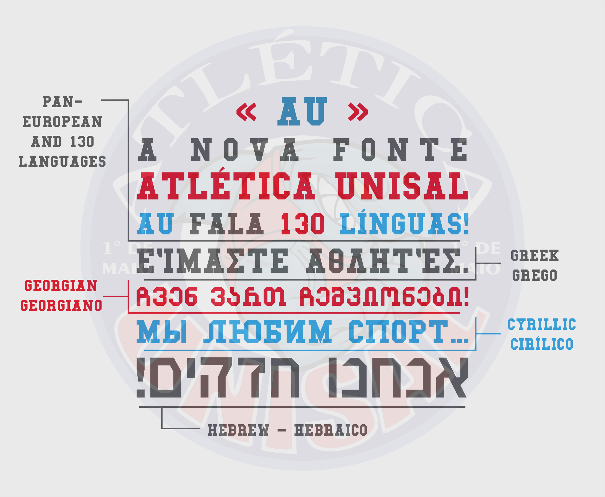

 

#### Why derived of Matthew Welch?

Matthew Welch's original font, «College» doesn't have pan-European and other nn-European glyphs, it only supports English and other accentless languages languages.

As it is licenced under MIT according to his site, so I can add and modify this font for supporting many lanuages as we can.

This font is still beta and see the plans in the end.

#### This font supports...

* Pan-Cyrillic – Abkhaz, Belarusian, Bulgarian, Kazakh, Kyrgyz, Macedonian, Mongolian, Ossetic, Russian, Serbian, Tabarassan, Tajik, Ukrainian
* Pan-European – all the languages of Europe
* Pan-African (only 74% part)
* Pinyin
* Georgian
* Monothonic Greek
* Polythonic Greek
* Archaic Greek (55% done)
* Hebrew (with marks and composites)
* Vietnamese
* Basic Maths

* It also added Azeri, Catalan, Dutch, Esperanto, Romnian and Turkish.

## Preview

## Plans to work
- [ ] Advanced maths
- [ ] Archaic Greek
- [ ] Arabic
- [ ] Armenian
- [ ] Farsi
- [ ] Japanese
- [ ] Chinese
- [ ] Mingrelian and Svan glyphs
